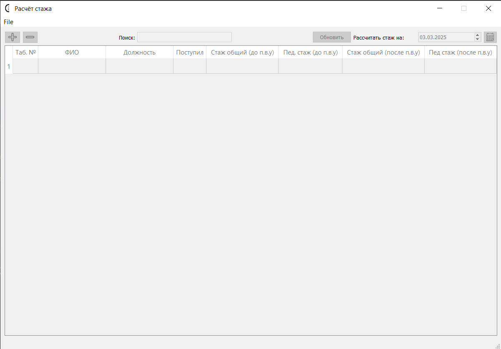
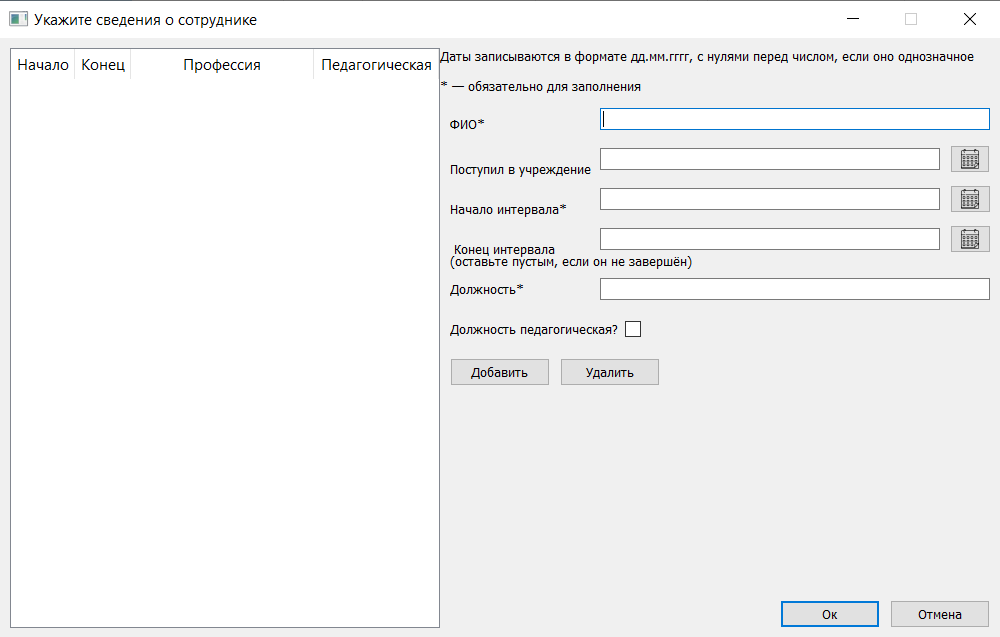

# Work Experience Calculator
**[Русский](#russian-version) | [English](#english-version)**

## Russian Version
### Что это?
Калькулятор для расчета рабочего стажа с учетом льготных периодов (например, педагогического). Использует PyQt5 для интерфейса и SQLite для хранения данных.

### Возможности
- Ввод данных о работниках и периодах работы.
- Учет льготных коэффициентов (например, 1.5 для педагогического стажа).
- Вывод стажа в годах, месяцах, днях.
- Хранение данных в SQLite.
- Экспорт результата в TXT.

### Установка
1. Склонируйте репозиторий:
   ```
   git clone https://github.com/FedotovSvyatoslav/WorkExperienceCalculator.git
   ```
   
2. Установите зависимости:
   ``` 
   pip install -r requirements.txt 
   ```

3. Запустите 
   ```
   python src/main.py
   ```

### Использование
* Откройте или создайте новую базу данных через меню File.
* Добавьте работника через интерфейс (двойной клик по строке таблицы).
* Введите периоды работы (даты и профессию) в диалоговом окне.
* Нажмите "Рассчитать" для вывода стажа.
* Выделите работника и в меню выберите "Save" для экспорта в TXT.

### Структура проекта
* src/core/: Логика расчета стажа.
* src/db/: Хранение данных (SQLite).
* src/gui/: Интерфейс (PyQt5).
* src/resources/: Ресурсы (иконки, .ui-файлы).

### Скриншоты 



### Автор
Федотов Святослав (GitHub: @FedotovSvyatoslav)

---

## English Version
### What is it? {#english-version}
A calculator for determining work experience, including preferential periods (e.g., teaching experience). It uses PyQt5 for the interface and SQLite for data storage.

### Features
- Input data about employees and their work periods.
- Accounting for preferential coefficients (e.g., 1.5 for teaching experience).
- Display of experience in years, months, and days.
- Data storage in SQLite.
- Export results to TXT.

### Installation
1. Clone the repository:
   ```
   git clone https://github.com/FedotovSvyatoslav/WorkExperienceCalculator.git
   ```
2. Install dependencies:
   ``` 
   pip install -r requirements.txt 
   ```
3. Run the application:
   ```
   python src/main.py
   ```

### Usage
* Open or create a new database via the File menu.
* Add an employee through the interface (double-click on a table row).
* Enter work periods (dates and profession) in the dialog window.
* Click "Calculate" to display the experience.
* Select an employee and choose "Save" from the menu to export to TXT.

### Project Structure
* src/core/: Work experience calculation logic.
* src/db/: Data storage (SQLite).
* src/gui/: Interface (PyQt5).
* src/resources/: Resources (icons, .ui files).

### Screenshots 


### Author
Svyatoslav Fedotov (GitHub: @FedotovSvyatoslav)